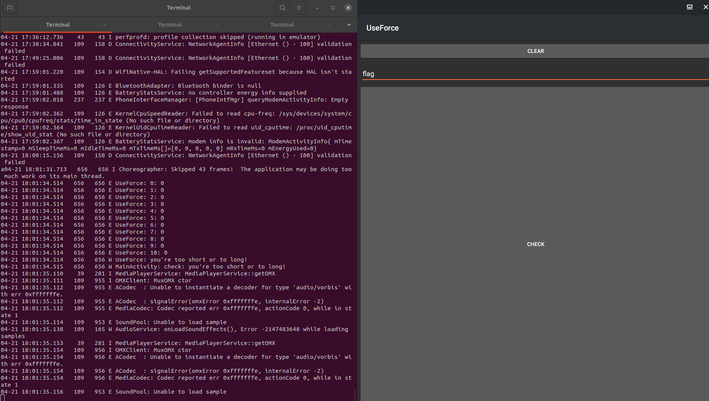

# DCTF 2022 - UseForce

## Introduction
 - We are given a file, `app-release.apk` and a hint: `'Are Dragons Bulletproof?'`.
 - I have never worked with an APK file as, my RE skills have never expanded beyond the classic PE/EXE. Really stepped out of my comfort zone for this one. Which I am glad I did.

## Intiital research
  - We can use [apktool](https://ibotpeaches.github.io/Apktool/) to unzip and have a look at source files.
    - This really didn't offer much help, except looking at the [.smali](https://mobsecguys.medium.com/smali-assembler-for-dalvik-e37c8eed22f9) files. 
    - Smali is the assembly code for Android's VM.
  - We can use [ByteCode-Viewer](https://github.com/Konloch/bytecode-viewer) to disassemble the package and see the code in java syntax which made reading the code much easier. Comparison:

    ##### Smali (app-release/com/dctf/useforce/MainActivity$2.smali)

    ``` smali
    .class Lcom/dctf/useforce/MainActivity$2;
    .super Ljava/lang/Object;
    .source "MainActivity.java"

    # interfaces
    .implements Landroid/view/View$OnClickListener;


    # annotations
    .annotation system Ldalvik/annotation/EnclosingMethod;
        value = Lcom/dctf/useforce/MainActivity;->onCreate(Landroid/os/Bundle;)V
    .end annotation

    .annotation system Ldalvik/annotation/InnerClass;
        accessFlags = 0x0
        name = null
    .end annotation


    # instance fields
    .field final synthetic this$0:Lcom/dctf/useforce/MainActivity;

    .field final synthetic val$editText:Landroid/widget/EditText;


    # direct methods
    .method constructor <init>(Lcom/dctf/useforce/MainActivity;Landroid/widget/EditText;)V
        .locals 0

        .line 45
        iput-object p1, p0, Lcom/dctf/useforce/MainActivity$2;->this$0:Lcom/dctf/useforce/MainActivity;

        iput-object p2, p0, Lcom/dctf/useforce/MainActivity$2;->val$editText:Landroid/widget/EditText;

        invoke-direct {p0}, Ljava/lang/Object;-><init>()V

        return-void
    .end method


    # virtual methods
    .method public onClick(Landroid/view/View;)V
        .locals 2

        .line 49
        new-instance p1, Ljava/lang/StringBuilder;

        invoke-direct {p1}, Ljava/lang/StringBuilder;-><init>()V

        const-string v0, "check: "

        invoke-virtual {p1, v0}, Ljava/lang/StringBuilder;->append(Ljava/lang/String;)Ljava/lang/StringBuilder;

        iget-object v0, p0, Lcom/dctf/useforce/MainActivity$2;->this$0:Lcom/dctf/useforce/MainActivity;

        iget-object v1, p0, Lcom/dctf/useforce/MainActivity$2;->val$editText:Landroid/widget/EditText;

        invoke-virtual {v1}, Landroid/widget/EditText;->getText()Landroid/text/Editable;

        move-result-object v1

        invoke-virtual {v1}, Ljava/lang/Object;->toString()Ljava/lang/String;

        move-result-object v1

        invoke-virtual {v0, v1}, Lcom/dctf/useforce/MainActivity;->a(Ljava/lang/String;)Ljava/lang/String;

        move-result-object v0

        invoke-virtual {p1, v0}, Ljava/lang/StringBuilder;->append(Ljava/lang/String;)Ljava/lang/StringBuilder;

        invoke-virtual {p1}, Ljava/lang/StringBuilder;->toString()Ljava/lang/String;

        move-result-object p1

        const-string v0, "MainActivity"

        invoke-static {v0, p1}, Landroid/util/Log;->w(Ljava/lang/String;Ljava/lang/String;)I

        return-void
    .end method

    ```

    ##### Java (app-release/com/dctf/useforce/MainActivity$2.class)
    ``` java
    package com.dctf.useforce;

    import android.util.Log;
    import android.view.View;
    import android.widget.EditText;

    class MainActivity$2 implements View.OnClickListener {
        final MainActivity this$0;
        final EditText val$editText;

        MainActivity$2(MainActivity var1, EditText var2) {
            this.this$0 = var1;
            this.val$editText = var2;
        }

        public void onClick(View var1) {
            StringBuilder var2 = new StringBuilder();
            var2.append("check: ");
            var2.append(this.this$0.a(this.val$editText.getText().toString()));
            Log.w("MainActivity", var2.toString());
        }
    }
    ```
- We can emulate the Android package with [Anbox](https://anbox.io/).
- We can also interface with that emultaor using [adb](https://developer.android.com/studio/command-line/adb).
- This has us at a good spot. We can not look at source, disassemble byte-code, emulate the package, and interact with the emulator / application.
  
## Setup 
- We install the tools via the steps supplied on the sites we visited.
- We can then install the app with the command: `sudo adb install app-release.apk`.
- Open `anbox` and launch the `useforce` application.
- We can see the emulator is up by running the command: `adb devices`.
    ``` bash
    $ adb devices
    List of devices attached
    emulator-5558	device
    ```
- Launching the application we are greeted with a somewhat simple flag checker:
  

## The Fun Part: Reversing the Applicaiton
- First thing to do is see how the application responded to input. We input text, click check, and nothing happens. Not a very exciting first experience.
- Using the disassembler, `Bytecode-Viewer`, not much stuck out inititally, except for one line: 
    ``` java
    import android.util.Log;
    ```
- I attempted to connect to the process for debugging with adb, but had no luck.
- Next thing to do is try and search for logs the application is writing to
- adb has a command which allows us to read system logs: `logcat`.
- We use the command and can see usefule data:

- We can see the application is writing to these logs and of use we see: `UseForce: you're too short or to long!`
- We can carve out these specific log entries for the application with the command: `adb shell logcat | grep "UseForce"`
- Next step is to see if we can determine the length of the flag. This is can be done by iterively adding a character until something in the logs change: 

- We found the length of the flag is 23 characters.
- We also know the given format for the flag will start with `dctf{` and ends with `}`.

- We notice in the logs something changes. At indexes `0,1,2,3,4` and `22`, the value changes from `0` to `1`. We can assume this is the program logging we have the characters at those indexes correct. That's a good sign. The challenge gets significantly easier from here and isn't as much of a 'black box' anymore. 
- We know from the flag format, the format inside the brackets will be any of the following characters: `ABCDEFGHIJKLMNOPQRSTUVWXYZabcdefghijklmnopqrstuvwxyz0123456789_-`.
- Now we can iterate through the indexes of the flag and try each character until all indexes reflect `1` or we are given some sort of `success` message in the logs.
- Luckily [pwntools](https://docs.pwntools.com/en/stable/adb.html) has an adb framework baked in that we can use.
- Next we create a program to interact with the application to change the flag, check it, then repeat the process over and over until it is correct!

    

- I came up with three iterative solutions (`slow_solpy`, `fast_sol.py`, `fastest_sol.py`).